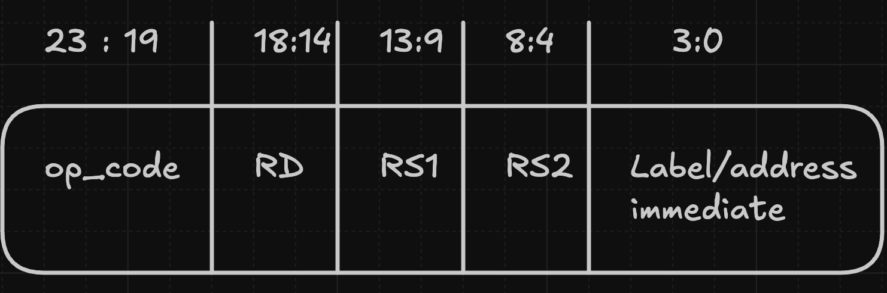
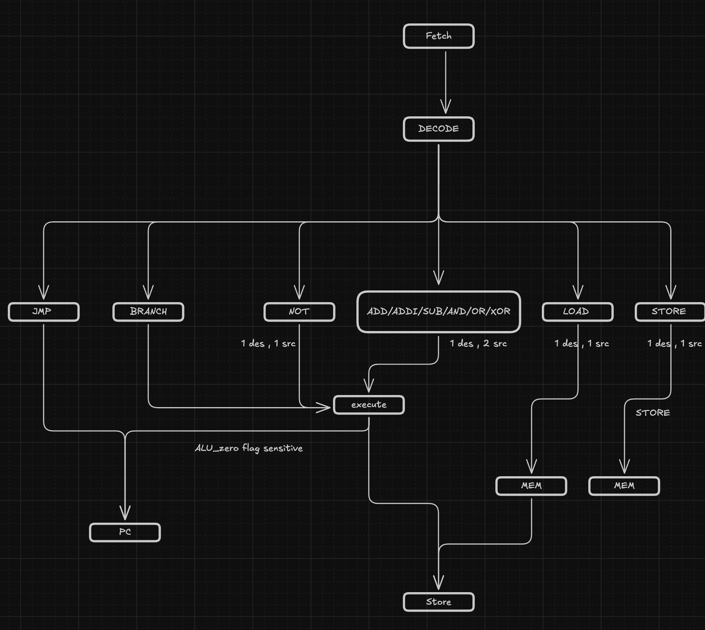
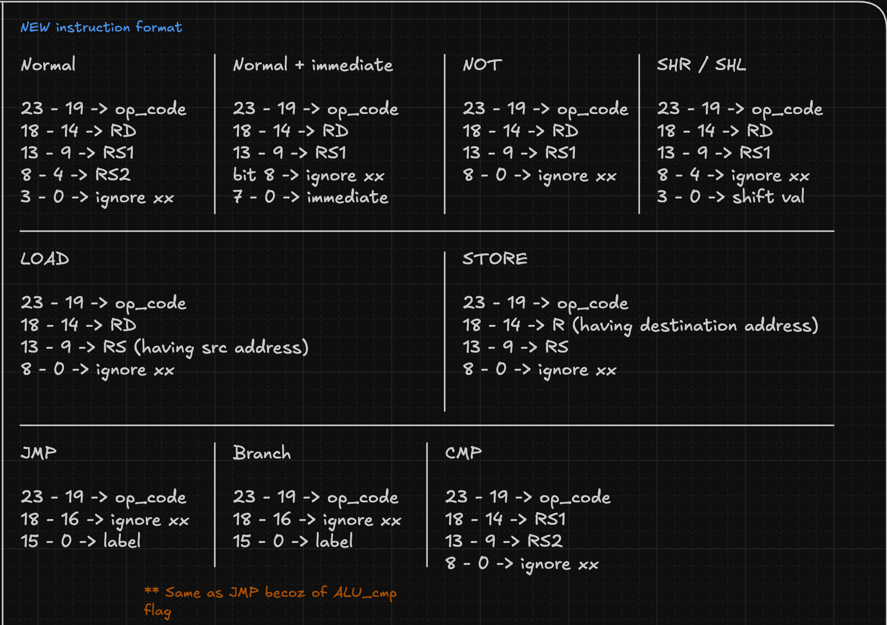
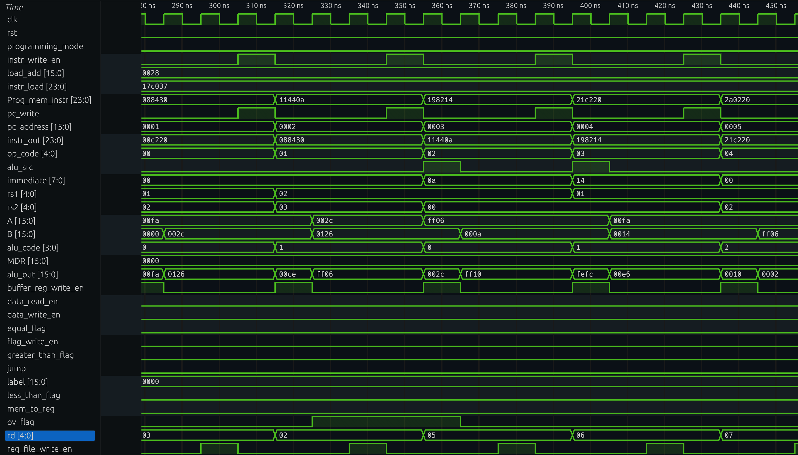

# Multi-Cycle 16-bit CPU in Verilog

A custom multi-cycle CPU designed and implemented from scratch in Verilog HDL. This project explores fundamental processor design concepts including datapath architecture, finite state machine (FSM) control, instruction set architecture (ISA) design, memory interfacing, and RTL implementation.

The processor follows a Harvard Architecture with separate program and data memories and executes instructions across multiple clock cycles using an FSM-based control unit.

---

## Demo

[!alt_text](Images/demo.gif)

- Demo of CPU executing Linear sort algo on an array with 6 elements
- Demo example code can be found in "tb/Programs/linear_sort.v

---

## Overview

This project was built as a learning exercise to gain a deeper understanding of:

- CPU datapath design
- Instruction execution flow
- Control unit implementation
- Register file design
- Memory operations
- ISA design
- Branching and flow control
- RTL design using Verilog

The design evolved through multiple iterations, resulting in an improved architecture with a cleaner ISA, larger register file, support for immediate instructions, comparison operations, and richer branch functionality.

---

## Features

### Architecture

- 16-bit data path
- 24-bit instruction width
- Harvard architecture
- Multi-cycle execution model
- FSM-based control unit
- Separate instruction and data memories
- Register-based load/store architecture

### Register File

- 32 General Purpose Registers
- 16-bit register width
- Dual read ports
- Single write port

### ALU Operations

- ADD
- SUB
- ADDI
- SUBI
- AND
- OR
- XOR
- NOT
- SHL
- SHR

### Comparison Operations

- CMP

### Memory Operations

- LOAD
- STORE

### Flow Control

- JMP
- BEQ
- BNE
- BLT
- BLE
- BGT
- BGE

---

# CPU Specifications

| Feature           | Value            |
| ----------------- | ---------------- |
| Data Width        | 16-bit           |
| Instruction Width | 24-bit           |
| Register Width    | 16-bit           |
| Register Count    | 32               |
| Program Memory    | 64K Instructions |
| Data Memory       | 64K Locations    |
| Architecture      | Harvard          |
| Execution Model   | Multi-Cycle      |
| Control Unit      | FSM Based        |

- Though practically integrated 64kB memory is impractical for RTL -> GDS2 flow
- Instead dedicated external memory modules are used for this

---

# Architecture

[!alt_text](Images/cpu_architecture.png)

The processor consists of the following major blocks:

## Program Counter (PC)

Maintains the address of the current instruction and supports:

- Sequential execution
- Jump instructions
- Conditional branching

## Program Memory

Stores instructions for execution.

## Instruction Register (IR)

Latches the fetched instruction before decoding.

## Control Unit (FSM)

Responsible for controlling the instruction lifecycle:

1. Fetch
2. Decode
3. Execute
4. Memory Access (if required)
5. Writeback

## Register File

Provides operand storage and destination register updates.

## ALU

Performs arithmetic, logical, shift, and comparison operations.

## Data Memory

Stores runtime data used by LOAD and STORE instructions.

---

# Instruction Format

The CPU uses a 24-bit instruction format.



Different instruction categories reuse fields depending on the instruction type.

---

# Instruction Set Architecture

## Arithmetic

| Instruction | Operation      |
| ----------- | -------------- |
| ADD         | RD = RS1 + RS2 |
| SUB         | RD = RS1 - RS2 |
| ADDI        | RD = RS1 + IMM |
| SUBI        | RD = RS1 - IMM |

---

## Logical

| Instruction | Operation           |
| ----------- | ------------------- |
| AND         | RD = RS1 and RS2    |
| OR          | RD = RS1 or RS2     |
| XOR         | RD = RS1 xor RS2    |
| NOT         | RD = ~RS1           |
| SHL         | Logical Shift Left  |
| SHR         | Logical Shift Right |

---

## Comparison

| Instruction | Description              |
| ----------- | ------------------------ |
| CMP         | Updates comparison flags |

- The CMP instruction is used before branch instructions to determine branching conditions.

---

## Memory Instructions

| Instruction | Description           |
| ----------- | --------------------- |
| LOAD        | Read data from memory |
| STORE       | Write data to memory  |

---

## Branch Instructions

| Instruction | Description                     |
| ----------- | ------------------------------- |
| JMP         | Unconditional Jump              |
| BEQ         | Branch if Equal                 |
| BNE         | Branch if Not Equal             |
| BLT         | Branch if Less Than             |
| BLE         | Branch if Less Than or Equal    |
| BGT         | Branch if Greater Than          |
| BGE         | Branch if Greater Than or Equal |

---

# Multi-Cycle Execution

The CPU executes instructions over multiple clock cycles.

## Arithmetic Instructions

```
Fetch
Decode
Execute
Writeback
```

## LOAD Instruction

```
Fetch
Decode
Address Calculation
Memory Read
Writeback
```

## STORE Instruction

```
Fetch
Decode
Address Calculation
Memory Write
```

This approach reduces hardware complexity while maintaining a simple datapath.

---

# Instruction Syntax

The testbench provides assembly-like macros for generating instructions.

```verilog
ADD(addr, rd, rs1, rs2)
SUB(addr, rd, rs1, rs2)

ADDI(addr, rd, rs1, imm)
SUBI(addr, rd, rs1, imm)

AND_OP(addr, rd, rs1, rs2)
OR_OP(addr, rd, rs1, rs2)
XOR_OP(addr, rd, rs1, rs2)

NOT_OP(addr, rd, rs1)

SHL(addr, rd, rs1, shamt)
SHR(addr, rd, rs1, shamt)

CMP(addr, rs1, rs2)

LOAD(addr, rd, addr_reg)
STORE(addr, addr_reg, data_reg)

JMP(addr, label)

BEQ(addr, label)
BNE(addr, label)
BLT(addr, label)
BLE(addr, label)
BGT(addr, label)
BGE(addr, label)
```

- addr is kept for easy usage of jump and branching statements
- Reason being as for this version label tag (as is assemble) doesn't exist yet

---

# Example Program

The following demonstrates the style used to program the CPU:

```verilog
ADDI(0, R1, R0, 48);
ADDI(1, R2, R0, 18);

CMP(2, R1, R2);
BEQ(3, DONE);

SUB(4, R1, R1, R2);
JMP(5, LOOP);
```

---

# Design Challenges

During development several architectural and RTL challenges were encountered.

### ISA Design

Designing a compact instruction set while maintaining simple decode logic required multiple revisions.

### Immediate Operand Handling

Routing immediate values through the datapath introduced additional muxing and control logic.

### FSM Design

Managing instructions with different execution lengths required careful FSM state planning.

### Control Signal Management

Several datapath registers were unintentionally overwritten during early development.

To solve this:

- Enable signals were added
- Registers update only in valid FSM states
- Control signals are generated exclusively by the control unit

### Branching Architecture

Supporting multiple branch types required introducing a dedicated comparison instruction and comparison flags.

---

# Verification

# Verification Methodology

The design was verified at both the module level and system level.

## Module-Level Verification

Each major RTL block was verified independently using constrained-random verification (CRV) and scoreboard-based checking.

### Components Verified

- ALU
- Register File
- Program Counter
- Data Memory
- Program Memory
- Instruction Register
- Control Unit FSM
- Comparator Logic

### Verification Strategy

#### Constrained Random Verification (CRV)

Randomized stimulus was generated within valid operating constraints to exercise a wide range of input combinations and corner cases.

Examples include:

- Random arithmetic operands
- Random logical operations
- Random shift amounts
- Random register addresses
- Random memory addresses

#### Scoreboard-Based Verification

A reference model was developed for each component.

For every transaction:

1. Expected output was calculated by the reference model.
2. DUT output was captured.
3. Results were automatically compared.
4. Any mismatch was flagged as a test failure.

This enabled automated checking across thousands of randomized test vectors.

---

# System-Level Verification

The complete CPU was verified by executing real programs written using the custom assembly-like instruction syntax.

The following algorithms were successfully implemented and executed:

## 1. Euclidean GCD Algorithm

Verified:

- Arithmetic operations
- Comparison instructions
- Conditional branches
- Loops
- Program flow control

## 2. Largest Element in an Array

Verified:

- LOAD operations
- Memory traversal
- Comparisons
- Conditional branching
- Register management

## 3. Linear Sort Algorithm

Verified:

- Nested loops
- Repeated memory accesses
- Conditional branches
- Data movement instructions
- End-to-end CPU functionality

---

# Verification Results

All module-level and system-level testcases passed successfully.

The successful execution of the above algorithms demonstrates correct operation of:

- Datapath
- FSM Control Unit
- Register File
- ALU
- Branch Logic
- Program Counter
- Instruction Memory
- Data Memory

under realistic software workloads rather than isolated instruction tests.

# Current Limitations

- No multiplication instruction
- No division instruction
- No signed arithmetic operations
- No barrel shifter
- Branch instructions require a preceding CMP instruction
- No interrupt support
- No pipelining
- No forwarding logic

---

# Future Improvements

Planned enhancements include:

- Hardware multiplier
- Hardware divider
- Signed arithmetic support
- Barrel shifter
- Pipeline implementation
- Hazard detection
- Data forwarding
- Interrupt support
- Memory mapped peripherals
- UART interface
- Bootloader support
- Assembly compiler / assembler

---

# Learning Outcomes

This project provided hands-on experience with:

- Computer Architecture
- Instruction Set Design
- Datapath Design
- FSM Design
- RTL Development
- Verilog HDL
- Processor Verification
- Digital Design
- Memory Systems
- Control Logic Design

---

# Project Structure

```text
.
├── rtl/
│   ├── alu.v
│   ├── register_file.v
│   ├── control_unit.v
│   ├── datapath.v
│   └── cpu_top.v
│
├── tb/
│   └── cpu_tb.v
│
├── docs/
│   ├── architecture.png
│   ├── isa.png
│   ├── fsm.png
│   └── waveforms/
│
└── README.md
```

---

# Images

## FSM



- As for branching we are using CMP instruction separately ahead of actual branching instruction
- ALU_execute stage for CMP is not considered as cycle for branch statements

## Instruction Formats



## Simulation Waveforms



---

## Author

Built as a personal RTL design project to understand how a processor works internally—from instruction fetch all the way to writeback.
